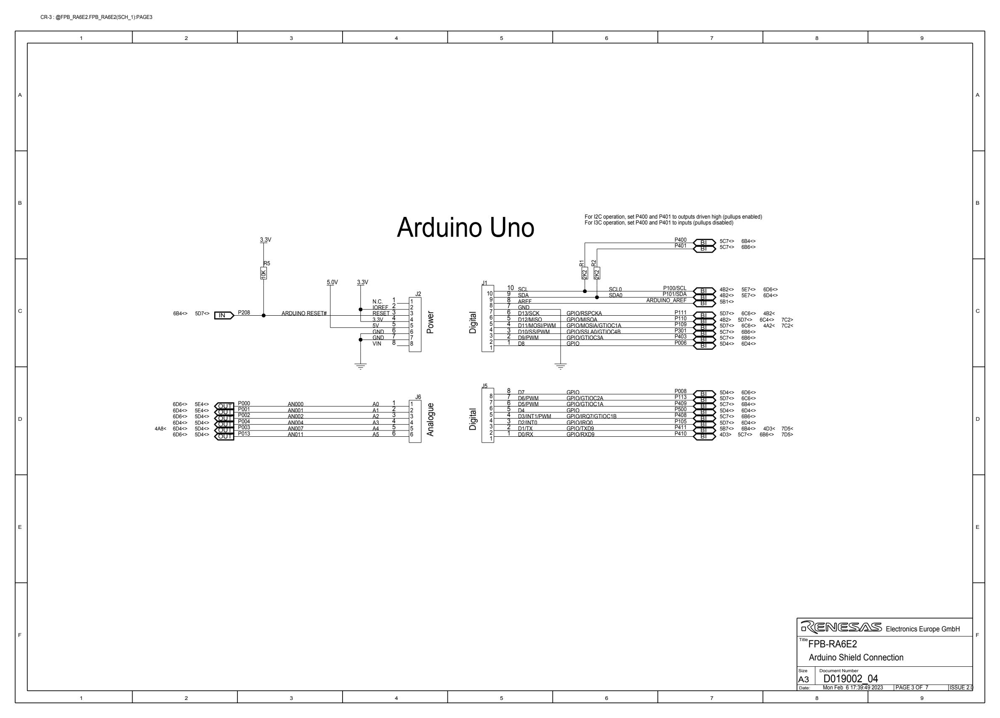

# ra6e2-fpb 开发板的Arduino生态兼容说明

**[English](README.md)** | **中文**

## 1 RTduino - RT-Thread的Arduino生态兼容层

ra6e2-fpb 开发板已经完整适配了[RTduino软件包](https://github.com/RTduino/RTduino)，即RT-Thread的Arduino生态兼容层。用户可以按照Arduino的编程习惯来操作该BSP，并且可以使用大量Arduino社区丰富的库，是对RT-Thread生态的极大增强。更多信息，请参见[RTduino软件包说明文档](https://github.com/RTduino/RTduino)。

### 1.1 如何开启针对本BSP的Arduino生态兼容层

Env 工具下敲入 menuconfig 命令，或者 RT-Thread Studio IDE 下选择 RT-Thread Settings：

```Kconfig
Hardware Drivers Config --->
    Onboard Peripheral Drivers --->
        [*] Compatible with Arduino Ecosystem (RTduino)
```

## 2 Arduino引脚排布

更多引脚布局相关信息参见 [pins_arduino.c](pins_arduino.c) 和 [pins_arduino.h](pins_arduino.h)。



| Arduino引脚编号  | ra6e2引脚编号 | 5V容忍 | 备注  |
| ------------------- | --------- | ---- | ------------------------------------------------------------------------- |
| 0 (D0) | P410 | 是 | Serial0-RX,默认被RT-Thread的UART设备框架uart0接管 |
| 1 (D1) | P411 | 是 | Serial0-TX,默认被RT-Thread的UART设备框架uart0接管 |
| 2 (D2) | P105 | 是 |  |
| 3 (D3) | P408 | 是 |  |
| 4 (D4) | P500 | 是 |  |
| 5 (D5) | P409 | 是 | PWM8-CH0,默认被RT-Thread的PWM设备框架pwm8的channel0接管 |
| 6 (D6) | P113 | 是 | PWM8-CH0,默认被RT-Thread的PWM设备框架pwm8的channel0接管 |
| 7 (D7) | P008 | 是 |  |
| 8 (D8) | P006 | 是 |  |
| 9 (D9) | P403 | 是 |  |
| 10 (D10) | P301 | 是 |  |
| 11 (D11) | P109 | 是 |  |
| 12 (D12) | P110 | 是 |  |
| 13 (D13) | P111 | 是 |  |
| 14 (D14) | P101 | 是 |  |
| 15 (D15) | P100 | 是 |  |
| 16 (A0) | P000 | 是 |  |
| 17 (A1) | P001 | 是 |  |
| 18 (A2) | P002 | 是 |  |
| 19 (A3) | P004 | 是 |  |
| 20 (A4) | P003 | 是 |  |
| 21 (A5) | P013 | 是 |  |

> 注意：
> 1.RTduino暂时不对MDK支持，建议使用GNU GCC工具链编译
> 2.renesas的pwm通道默认使用channel0，详细驱动细节请查阅`bsp\renesas\libraries\HAL_Drivers\drv_pwm.c`文件